# 🔐 Caesar Cipher — Bash & Python

Реализация шифра Цезаря для всех текстовых файлов в указанном каталоге и его поддиректориях с использованием утилиты `tr`.

---

## 📖 Что такое шифр Цезаря

Шифр Цезаря — один из старейших методов шифрования. Каждая буква в тексте заменяется на букву, стоящую на **N позиций правее** в алфавите. N называется **ключом** (или сдвигом).

<p align="center">

</p>

Алфавит закольцован — буква `z` при сдвиге 3 превращается в `c`.

---

## ⚙️ Как работает алгоритм

1. Принять на вход путь к каталогу и ключ (число)
2. Рекурсивно найти все файлы с расширением `.txt` в каталоге и его поддиректориях
3. Для каждого файла применить шифр Цезаря через утилиту `tr`
4. Перезаписать файл зашифрованным содержимым

<p align="center">

</p>

Утилита `tr` заменяет символы из одного набора на символы другого набора.  
Для сдвига 3 вызов выглядит так:

```bash
tr 'abcdefghijklmnopqrstuvwxyzABCDEFGHIJKLMNOPQRSTUVWXYZ' \
   'defghijklmnopqrstuvwxyzabcDEFGHIJKLMNOPQRSTUVWXYZABC'
```

Оба скрипта — Bash и Python — **строят эти строки динамически** по ключу и дают **одинаковый результат**.

---

## 📁 Структура проекта

```
.
├── solution.sh     # реализация на Bash
├── solution.py     # реализация на Python
├── assets/
│   ├── alphabet.svg    # анимация алфавита
│   └── traversal.svg   # анимация обхода файлов
└── README.md
```

---

## 🚀 Использование

### Bash

```bash
# Дать права на выполнение (один раз)
chmod +x solution.sh

# Запуск
./solution.sh -d <каталог> -k <ключ>
```

### Python

```bash
python3 solution.py -d <каталог> -k <ключ>
```

### Аргументы

| Флаг | Длинный вариант | Описание | Обязателен |
|------|-----------------|----------|------------|
| `-d` | `--directory`   | Путь к целевому каталогу | ✅ |
| `-k` | `--key`         | Ключ шифрования (целое число) | ✅ |
| `-h` | `--help`        | Показать справку | — |

---

## 💡 Примеры

**Зашифровать все `.txt` файлы в папке `./texts` с ключом 3:**
```bash
./solution.sh -d ./texts -k 3
python3 solution.py -d ./texts -k 3
```

**Использовать отрицательный ключ (сдвиг влево):**
```bash
./solution.sh -d ./texts -k -5
python3 solution.py -d ./texts -k -5
```

**Классический ROT13 (ключ 13 = самодешифрующийся):**
```bash
./solution.sh -d ./texts -k 13
python3 solution.py -d ./texts -k 13
```

**Посмотреть справку:**
```bash
./solution.sh --help
python3 solution.py --help
```

---

## 🔄 Дешифрование

Для дешифрования достаточно применить обратный ключ: `26 - N`.

```bash
# Зашифровали с ключом 3 — расшифровываем с ключом 23
./solution.sh -d ./texts -k 23
```

Или можно использовать отрицательный ключ:
```bash
./solution.sh -d ./texts -k -3
```

---

## 🛠️ Детали реализации

### Bash (`solution.sh`)

- Аргументы командной строки разбираются вручную через цикл `while` + `case`
- Рекурсивный обход файлов выполняется через `find -type f -name "*.txt"`
- Сдвинутый алфавит строится через срезы строк: `${str:N}${str:0:N}`
- Шифрование через `tr`, результат записывается во временный файл (`mktemp`), затем заменяет оригинал через `mv`

### Python (`solution.py`)

- Аргументы разбираются через стандартную библиотеку `argparse`
- Рекурсивный обход — `os.walk()`
- Утилита `tr` вызывается через `subprocess.run()`
- Временный файл создаётся через `tempfile.NamedTemporaryFile()`, замена оригинала — через `os.replace()`

Интерфейс обоих скриптов **идентичен** — одни и те же флаги, одинаковый вывод, одинаковый результат.

---

## ⚠️ Обработка ошибок

| Ситуация | Поведение |
|----------|-----------|
| Не переданы обязательные аргументы | Выводится справка (`--help`), выход с кодом `1` |
| Ключ не является целым числом | Сообщение об ошибке, выход с кодом `1` |
| Указанный каталог не существует | Сообщение об ошибке, выход с кодом `1` |

---

## 📋 Требования

- **Bash** версии 4.0+
- **Python** версии 3.6+
- Утилита **`tr`** (входит в стандартную поставку Linux/macOS)
